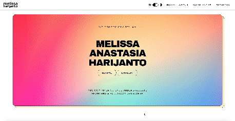
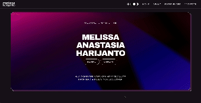

# melissa's website v3

v3 is **mobile-responsive** and provides both light and dark modes. It consists of *Home*, *About*, *Experiences*, and *Projects*. The previews of the site is shown below:

*Light Mode*

*Dark Mode*

View v1 and v2 here: 
- [web-v1](https://melissaharijanto.github.io/web-v1/)
- [web-v2](https://melissaharijanto.github.io/web-v2/)

--- 

## reuse

In **any** case of reuse, DO NOT REMOVE THE FOOTER. everything else can be changed.

If you are not a developer, simply go to the `src` folder, find the `constants` folder and edit accordingly:
- `hero.ts` is for the home section of the site;
- `navbar.ts` is to edit the links of the navigation bar;
- `about.ts` is to edit the about section;
- `projects.ts` is to edit the projects section;
- `experiences.ts` is to edit the experiences section.

`styles.ts` is to edit the custom CSS styles. Editing it is **not** recommended, especially if you are not familiar with Tailwind CSS. 

You may edit `colors.ts` to determine the color of the background and the text for dark and light modes.

